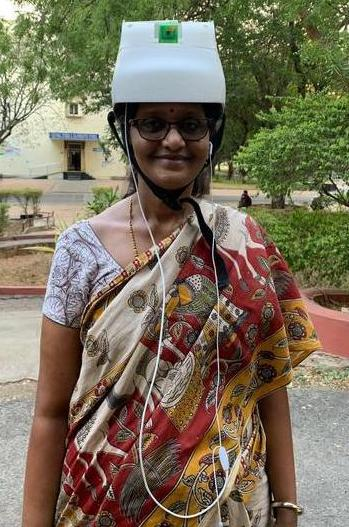

# Smart Cap for Alzheimer's Patient using Deep Learning
[Paper](https://ieeexplore.ieee.org/abstract/document/8929412)
Due to medical advancements in 20th century there has been an explosive growthin the population and life expectancy. Even after such medical advancements therestill exist some irreversible diseases from which modern medicine cannot helphumans to recover fully.  Alzheimer’s is one such progressive disease that causessevere problems with thinking, memory and behaviour. The people suffering fromAlzheimer’s disease have a tendency to forget most of the things in their life. Theytend to forget people they know, scheduled meetings, medicines they are supposed totake, their daily routine and other important things. In this work, we are proposing aprototype of wearable smart cap which is an assistive device with ability to recognizepeople related to the patient, it uses a deep learning model for face recognition. Incontrast to the other approaches which rely on deep networks trained on specificnumber of classes making introduction of new classes difficult in the system, ourapproach extracts unique feature vectors from faces in the dataset and trains classifieron them hence, it can be easily trained for classifying new classes. We have designeda 3D model for the cap, the implementation uses raspberry pi board embedded intoit for computation and a camera mounted on top of it, that captures the faces ofpeople coming into the sight of the patient, in real time and then detects the faces,recognizes them and indicates their names to the patient instantaneously in the formof speech.  This device is very much useful for the patients as it enables them torecognize the people nurturing them and also harmful strangers.

## Install dlib and face_recognition on a Raspberry Pi
Instructions tested with a Raspberry Pi 3 with an 8GB and 16GB  memory card.

### Steps

* Download the latest Raspbian Jessie Light image. Earlier versions of Raspbian won't work.

* Write it to a memory card using Etcher, put the memory card in the RPi and boot it up.

* Log in. Default username / password is pi / raspberry.

* Set up Wifi (if you are using Wifi) according to the Raspberry Pi instructions.

* Run sudo raspi-config and configure the basics:

	* Set up your keyboard layout (It defaults to a British keyboard layout)
	* Change default user password
	* Enable the Raspberry Pi camera (if you have one attached)
	* Configure gpu memory split under 'Advanced'. Set it up '16'.
	* Save changes and reboot.
Install required libraries with these commands:
```bash
sudo apt-get update
sudo apt-get upgrade
sudo apt-get install build-essential \
    cmake \
    gfortran \
    git \
    wget \
    curl \
    graphicsmagick \
    libgraphicsmagick1-dev \
    libatlas-dev \
    libavcodec-dev \
    libavformat-dev \
    libboost-all-dev \
    libgtk2.0-dev \
    libjpeg-dev \
    liblapack-dev \
    libswscale-dev \
    pkg-config \
    python3-dev \
    python3-numpy \
    python3-pip \
    zip
sudo apt-get clean
```
Download and install dlib v19.6:
```bash
mkdir -p dlib
git clone -b 'v19.6' --single-branch https://github.com/davisking/dlib.git dlib/
cd ./dlib
sudo python3 setup.py install --compiler-flags "-mfpu=neon"
```
Install face_recognition:
```bash
sudo pip3 install face_recognition
```
Install audio realted libraries:
```bash
sudo pip3 install pyaudio
```
Install OpenCV:
```bash
sudo apt update
sudo apt install python3-opencv
```
## Demo of the smart Cap




## Paper
```bash
L. Boppana, P. Kumari, R. Chidrewar and P. K. Gadde, "Smart Cap for Alzheimer Patients using Deep Learning," TENCON 2019 - 2019 IEEE Region 10 Conference (TENCON), Kochi, India, 2019, pp. 2466-2471.[Smart Cap for Alzheimer Patients using ```
